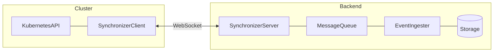

# Proposal: Pluggable Message Queue for Synchronizer (Kafka)

- **Status:** Draft – discussion
- **Scope:** [`synchronizer`](https://github.com/kubescape/synchronizer); [`event-ingester-service`](https://github.com/armosec/event-ingester-service) (follow-up); [`helm-charts`](https://github.com/kubescape/helm-charts) (config plumbing)
- **Author:** Harshit Gandhi (gandhiharshit716@gmail.com)
- **Date:** 2026-06-20
- **Related:**
  - [synchronizer#151](https://github.com/kubescape/synchronizer/issues/151): Support for alternative message queues

## Summary

The synchronizer server today uses Apache Pulsar as the backend message bus
between WebSocket-connected clusters and backend services (event ingester,
storage). This proposal adds a **pluggable message queue layer** and
implements **Kafka as the first alternative backend**, while keeping Pulsar as
the default with no behavior change for existing deployments.

Clusters continue to connect via WebSocket only; Kafka replaces Pulsar
**behind the synchronizer server**. A coordinated follow-up in
`event-ingester-service` is required for end-to-end production deployments.

## Motivation

[synchronizer#151](https://github.com/kubescape/synchronizer/issues/151)
raised the need for message queue alternatives. The key drivers:

- **Operational footprint.** Pulsar is capable for high-volume messaging, but
  is heavier to run than many alternatives. Teams managing fleet-wide
  security data across many clusters may prefer a lighter edge buffer or an
  MQ they already operate.
- **Enterprise adoption.** Kafka has widespread adoption. Issue author
  [@stone-z](https://github.com/stone-z) expects Kafka to be available
  internally on the order of months and wants to route kubescape (and other
  CNCF security tool) data through a common queue.
- **Maintainer alignment.** [@matthyx](https://github.com/matthyx) agreed the
  queue should be abstracted and that the synchronizer should remain generic
  enough to support alternative backends.

### Current architecture



**Today `MessageQueue` = Apache Pulsar only.** In-cluster synchronizer clients
never connect to the queue directly; they use WebSocket to the synchronizer
server, which bridges to Pulsar.

### Bidirectional flow on one Pulsar topic today

Both directions share the topic `persistent://armo/kubescape/synchronizer`
(configured as short name `synchronizer`):

| Direction | Producer | Consumer | Purpose |
|-----------|----------|----------|---------|
| Cluster → Backend | Synchronizer server | Event ingester (subscription `synchronizer-a`) | Object sync events to Postgres/S3 |
| Backend → Cluster | Event ingester / backend services | Synchronizer server (Pulsar Reader) | Commands to connected WebSocket clients |

The server filters out its own outbound messages using a Pulsar message key
(`SynchronizerServerProducer`) so it does not process messages it produced.

## Goals

- Introduce a backend-agnostic messaging abstraction with a config-driven
  factory.
- Implement Kafka producer and consumer matching current Pulsar semantics.
- Preserve existing message types, JSON payloads, and property/header keys
  (defined in
  [`messaging/messages.go`](https://github.com/kubescape/synchronizer/blob/main/messaging/messages.go)).
- Keep Pulsar as the default; zero breaking change for current Helm/config
  deployments.
- Document a coordinated migration path for `event-ingester-service` (separate
  repo, required for end-to-end production use).

## Non-goals

- Per-cluster lightweight edge queues (related future work from the issue
  author; out of scope for this proposal).
- Replacing WebSocket transport between the in-cluster client and server.
- NATS or other backends in v1 (Kafka first; others can follow the same
  interface).
- Changing synchronizer client (in-cluster) code — it only uses WebSocket.
- Full `event-ingester-service` Kafka migration in the same PR (tracked as
  Phase 3 follow-up).

## Background: current implementation

Much of the abstraction already exists; the remaining work is wiring and a new
backend implementation.

| Layer | File | Status |
|-------|------|--------|
| Interfaces | [`messaging/interface.go`](https://github.com/kubescape/synchronizer/blob/main/messaging/interface.go) | `MessageProducer`, `MessageReader` defined |
| Message schema | [`messaging/messages.go`](https://github.com/kubescape/synchronizer/blob/main/messaging/messages.go) | 9 event types; property keys are transport-agnostic |
| Backend adapter | [`adapters/backend/v1/adapter.go`](https://github.com/kubescape/synchronizer/blob/main/adapters/backend/v1/adapter.go) | Depends on `MessageProducer` interface |
| Pulsar impl | [`adapters/backend/v1/pulsar.go`](https://github.com/kubescape/synchronizer/blob/main/adapters/backend/v1/pulsar.go) | Only concrete MQ implementation (~440 lines) |
| Wiring | [`cmd/server/main.go`](https://github.com/kubescape/synchronizer/blob/main/cmd/server/main.go) | Hard-coded Pulsar bootstrap |
| Config | [`config/config.go`](https://github.com/kubescape/synchronizer/blob/main/config/config.go) | `Backend.PulsarConfig` is Pulsar-specific |

### Pulsar-specific patterns to address

1. **Self-loop filter.** The server sets message key
   `SynchronizerServerProducer` on outbound messages; the reader skips
   messages with that key
   ([`pulsar.go`](https://github.com/kubescape/synchronizer/blob/main/adapters/backend/v1/pulsar.go)).
2. **Reader, not consumer.** The server uses `pulsar.Reader` with
   `StartMessageID=Latest`, no ack/nack. Each pod receives all messages and
   filters locally via `IsRelated()` (client must be connected on that pod).
3. **Large messages.** Producer enables `EnableChunking: true` for PutObject
   and reconciliation payloads.
4. **Reconciliation mutex.** Serializes handling of large
   `ReconciliationRequest` messages inside the Pulsar reader.

### Message property / header contract

All property keys are defined in `messaging/messages.go` and must be preserved
as Kafka record headers for ingester compatibility:

| Property key | Purpose |
|--------------|---------|
| `timestamp` | RFC3339Nano produce time |
| `cluster` | Target cluster name |
| `account` | Target account |
| `event` | Event type discriminator |
| `group`, `version`, `resource`, `name`, `namespace`, `resourceVersion` | Resource metadata (on object events) |

| Event | Produced by server | Consumed by server |
|-------|-------------------|-------------------|
| PutObject, PatchObject, VerifyObject, DeleteObject, GetObject | Yes | Yes |
| ServerConnected, ConnectedClients | Yes | No (ingester only) |
| ReconciliationRequest | Yes | Yes |
| ReconciliationRequestBatch | Yes | No |

## Proposed design

### Config schema (discriminated backend)

Introduce a `messageQueue` block with a `type` discriminator. Legacy Pulsar
config remains supported unchanged.

**Kafka (new):**

```json
{
  "backend": {
    "messageQueue": {
      "type": "kafka",
      "kafkaConfig": {
        "bootstrapServers": ["kafka:9092"],
        "producerTopic": "armo.kubescape.synchronizer.out",
        "consumerTopic": "armo.kubescape.synchronizer.in",
        "groupIdPrefix": "synchronizer-server",
        "compressionType": "zstd",
        "maxMessageBytes": 10485760,
        "securityProtocol": "PLAINTEXT"
      }
    },
    "consumerWorkers": 10
  }
}
```

**Pulsar (legacy, unchanged):**

```json
{
  "backend": {
    "pulsarConfig": {
      "url": "pulsar://localhost:6650",
      "tenant": "armo",
      "namespace": "kubescape",
      "adminUrl": "http://localhost:8081",
      "clusters": ["standalone"]
    },
    "producerTopic": "synchronizer",
    "consumerTopic": "synchronizer",
    "subscription": "synchronizer-server",
    "consumerWorkers": 10
  }
}
```

**Config resolution** in `config/config.go`:

1. If `messageQueue.type` is set → use factory for that backend.
2. Else if `pulsarConfig` is set → use Pulsar (existing behavior).
3. Else → mock adapter (existing fallback in `cmd/server/main.go`).

Optional `kafkaConfig` fields for production (documented, not required for
v1): `saslMechanism`, `saslUsername`, `saslPassword`, `tlsEnabled`,
`tlsCaCertPath`.

### Topic strategy: split topics (recommended)

Use **two Kafka topics** instead of mirroring Pulsar's single bidirectional
topic:

| Topic | Direction | Producer | Consumer |
|-------|-----------|----------|----------|
| `armo.kubescape.synchronizer.out` | Cluster → Backend | Synchronizer server | Event ingester |
| `armo.kubescape.synchronizer.in` | Backend → Cluster | Event ingester / backend | Synchronizer server |

**Why split topics:**

- Eliminates the self-loop key filter (a Pulsar-specific workaround).
- Clearer ACLs and monitoring per direction.
- Simpler consumer group semantics.

| Pulsar today | Kafka equivalent |
|--------------|-------------------|
| `persistent://armo/kubescape/synchronizer` (server outbound) | `armo.kubescape.synchronizer.out` |
| Same topic (server inbound) | `armo.kubescape.synchronizer.in` |

**Alternative (not recommended for v1):** single topic with record key or
header filter `SynchronizerServerProducer` — mirrors Pulsar but adds
operational complexity without benefit when split topics are available.

### Factory and package layout

New and refactored files in the synchronizer repo:

```
messaging/
  factory.go          # NewProducer(cfg), NewReader(cfg) by type
  handler.go          # Shared dispatch logic extracted from pulsar.go
  metrics.go          # Backend-agnostic producer metrics

adapters/backend/v1/
  pulsar.go           # Slimmed: Pulsar-specific transport only
  kafka.go            # KafkaMessageProducer + KafkaMessageConsumer
```

Factory wiring in `cmd/server/main.go`:

```go
producer, reader, err := messaging.NewFromConfig(cfg.Backend)
adapter := backend.NewBackendAdapter(ctx, producer, cfg.Backend)
reader.Start(ctx, adapter)
```

### Kafka producer design

Implement `MessageProducer` in `adapters/backend/v1/kafka.go`.

**Client library:** recommend [`segmentio/kafka-go`](https://github.com/segmentio/kafka-go)
for pure Go and lighter dependencies. Confirm with maintainers; alternative is
`confluent-kafka-go` (librdkafka wrapper, broader feature set).

| Concern | Design |
|---------|--------|
| Metadata | Map Pulsar properties → Kafka record **headers** (same key names) |
| Produce mode | Async with error logging + metrics (mirror Pulsar `SendAsync` callback) |
| Compression | ZSTD (match Pulsar `CompressionLevel: 1`) |
| Self-loop | Not needed with split topics |
| Large payloads | Rely on broker `max.message.bytes` (default 10 MB, configurable). App-level chunking deferred unless payloads exceed limit in practice |
| Partition key | Optional `{account}/{cluster}` for per-cluster ordering (not required for v1 parity) |

### Kafka consumer design (critical semantics)

The synchronizer server must replicate Pulsar **Reader fan-out**, not competing
consumer semantics. This is the highest-risk area of the migration.

| Pulsar Reader behavior | Kafka equivalent |
|------------------------|------------------|
| No subscription; each pod independent | **Unique `group.id` per pod:** `{groupIdPrefix}-{hostname}` |
| `StartMessageID = Latest` | `auto.offset.reset=latest` for new consumer groups |
| No ack; handler errors logged only | At-most-once for v1: auto-commit before handler (match Pulsar) |
| All pods see all messages | Each pod in its own consumer group receives the full topic |
| Filter by `IsRelated()` | Unchanged — application-level routing to WebSocket clients |

**Do not** use a shared consumer group across synchronizer server pods. A
competing consumer would partition messages across pods and break routing to
connected WebSocket clients.

Worker pool pattern preserved:

```
poll loop → buffered channel (consumerWorkers, default 10) → handleSynchronizerMessage()
```

Shared dispatch logic extracted from `pulsar.go` into `messaging/handler.go`;
both Pulsar and Kafka backends call it. Move `reconciliationMessageMutex` into
the handler (broker-agnostic).

### Pulsar refactor (Phase 1, pre-Kafka)

Before or alongside Kafka, refactor Pulsar to:

- Use a header property (`x-producer-source: synchronizer-server`) for self-loop
  filtering in addition to (then instead of) message key.
- Extract shared handler and metrics into `messaging/`.
- Introduce factory wiring with Pulsar as the only backend.

This phase ships no behavior change and requires no config migration.

### Metrics

Generalize producer metrics in `adapters/backend/v1/metrics.go`:

- `synchronizer_mq_producer_messages_produced_count{backend, status, event_type, kind, account, cluster}`
- `synchronizer_mq_producer_message_payload_bytes_produced_count{backend, ...}`

Keep existing `synchronizer_pulsar_producer_*` metric names as aliases during a
deprecation window.

Adapter-level metrics (`synchronizer_connected_clients_count`,
`synchronizer_client_disconnection_count`) remain unchanged.

## Cross-repo: event ingester coordination

End-to-end synchronization requires coordinated changes in
`event-ingester-service` (not in the synchronizer repo).

Today (`configuration/ingester/config.json` in synchronizer):

```json
"SynchronizerIngesterConfig": {
  "enabled": false,
  "topic": "synchronizer",
  "subscription": "synchronizer-a",
  "workersNumber": 1
}
```

Follow-up in `event-ingester-service`:

| Component | Today | Kafka |
|-----------|-------|-------|
| Ingest cluster events | Pulsar consumer on `synchronizer`, subscription `synchronizer-a` | Kafka consumer on `synchronizer.out` |
| Send backend commands | `synchronizer_producer.NewPulsarProducer` | Kafka producer on `synchronizer.in` |
| Message format | Pulsar properties + JSON payload | Kafka headers + JSON payload (same keys) |

Phase 3 is **required for production Kafka deployments** but does not block
Phase 1 (refactor) or Phase 2 (synchronizer-only Kafka with integration tests
using a test ingester or mock consumer).

## Implementation phases

| Phase | Scope | Repo | Success criteria |
|-------|-------|------|------------------|
| **0** | This design doc | designs-and-proposals | Maintainer review (@matthyx, @stone-z) |
| **1** | Refactor: factory, shared handler, header-based self-loop, Pulsar-only | synchronizer | All existing tests pass; no config change required |
| **2** | Kafka producer + consumer | synchronizer | New config path works; integration tests with testcontainers Kafka/Redpanda |
| **3** | Ingester Kafka support | event-ingester-service | Full E2E cluster ↔ storage sync on Kafka |
| **4** | Helm charts + docs | helm-charts, synchronizer README | Operator-facing config for Kafka backend |

## Testing strategy

Mirror the existing harness in
[`tests/synchronizer_integration_test.go`](https://github.com/kubescape/synchronizer/blob/main/tests/synchronizer_integration_test.go):

- Spin up Kafka via testcontainers (Redpanda as a lightweight alternative).
- Two synchronizer server instances + WebSocket clients (existing pattern).
- Assert message headers on produce (equivalent to TC13).
- Broker restart resilience test (equivalent to TC09).
- Keep Pulsar tests running in CI until Kafka is GA.

## Rollout and backward compatibility

- Pulsar remains the default when `pulsarConfig` is present and
  `messageQueue.type` is absent.
- No Helm chart changes required until Phase 4.
- Kafka ships as opt-in via `messageQueue.type: kafka`.
- Operational prerequisites: Kafka topic creation, ACLs, `max.message.bytes`
  tuning, SASL/TLS configuration for production.

## Alternatives considered

| Alternative | Why not chosen for v1 |
|-------------|----------------------|
| NATS JetStream first | This proposal targets Kafka per community discussion and issue author timeline |
| Single Kafka topic + key filter | Split topics are cleaner; avoids self-loop hack |
| Pulsar sources/sinks to Kafka | Adds infrastructure complexity; does not remove Pulsar dependency from synchronizer |
| Competing consumer group across pods | Breaks multi-pod routing — each pod must see all backend commands |
| Status quo (Pulsar only) | Does not address enterprise Kafka adoption or footprint concerns from #151 |

## Risks

1. **Fan-out consumer groups.** Wrong `group.id` strategy breaks multi-pod
   deployments. Each synchronizer server pod must consume the full inbound
   topic independently.
2. **Large message limits.** Pulsar chunking masks broker size limits today.
   Kafka requires broker `max.message.bytes` tuning or app-level chunking for
   very large PutObject payloads.
3. **Delivery semantics.** Upgrading from at-most-once (current Pulsar
   reader) to at-least-once requires idempotent handlers and explicit commit
   strategy.
4. **Cross-repo dependency.** Synchronizer Kafka alone is incomplete without
   ingester Phase 3.

## Open questions (for team discussion)

1. Confirm split-topic vs single-topic approach.
2. Preferred Kafka Go client library (`kafka-go` vs `confluent-kafka-go`).
3. Delivery semantics for v1: match Pulsar at-most-once or upgrade to
   at-least-once?
4. Partition key strategy: is per-`(account, cluster)` ordering needed?

## References

- [synchronizer#151](https://github.com/kubescape/synchronizer/issues/151)
- [synchronizer README](https://github.com/kubescape/synchronizer/blob/main/README.md)
- [`messaging/interface.go`](https://github.com/kubescape/synchronizer/blob/main/messaging/interface.go)
- [`messaging/messages.go`](https://github.com/kubescape/synchronizer/blob/main/messaging/messages.go)
- [`adapters/backend/v1/pulsar.go`](https://github.com/kubescape/synchronizer/blob/main/adapters/backend/v1/pulsar.go)
- [`cmd/server/main.go`](https://github.com/kubescape/synchronizer/blob/main/cmd/server/main.go)